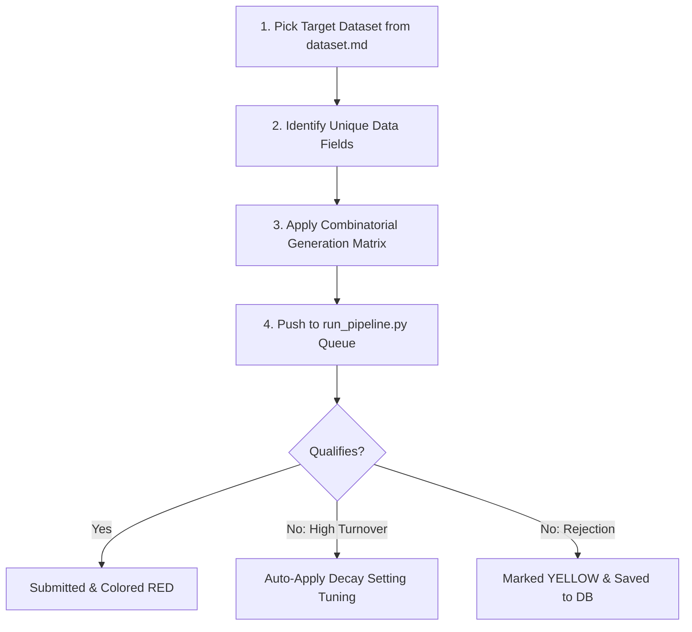

# Alpha Forge - Systematic Alpha Generation Cookbook

> [!IMPORTANT]
> **CRITICAL REFERENCE**: Always read the **[Alpha Creation Strategy & Master Reference Manual](file:///c:/Users/Admin/Documents/VIBE_YT/wq/documentation/alpha_creation_strategy.md)** first. It outlines crucial event timeline compliance breakthroughs, FastExpr bounds restrictions, and error resolution protocols.

This guide details how to systematically target WorldQuant datasets from [dataset.md](file:///c:/Users/Admin/Documents/VIBE_YT/wq/dataset.md) and generate up to **200 unique alpha formulas** per dataset. By combining dataset fields with core price, volume, returns, and cross-sectional operators, we can exhaustively explore the combinatorial space of alpha research.

---

## 1. Systematic Generation Strategy

To scale your research to thousands of alphas, we proceed **dataset-by-dataset** through a three-step cycle:



### The 200-Alpha Combination Matrix
To reach 200 alphas per dataset, we expand each unique field `x` across a combination grid:
*   **5 Core Mathematical Profiles**: Time-series momentum, mean reversion, cross-sectional ranking, group neutralizing, and price-volume interactions.
*   **8 Lookback Periods ($d$)**: $d \in \{2, 3, 5, 10, 15, 20, 22, 40\}$
*   **5 Scaling/Smoothing Operators**: Raw, `rank()`, `scale()`, `zscore()`, `ts_decay_linear()`.
$$\text{Combinations} = 5\text{ Profiles} \times 8\text{ Lookbacks} \times 5\text{ Operators} = 200\text{ unique alphas}$$

---

## 2. FastExpr Syntax Rules & Cheat Sheet

WorldQuant Brain uses **FastExpr**, a highly optimized vector language. When creating combinations, follow these strict compliance rules to avoid compilation errors:

### Critical Compliance Rules
1.  **Division by Zero Protection**: Never divide by a raw variable. Always append a tiny constant (e.g. `+ 0.0001` or `+ 0.001`) to the denominator.
    *   *Incorrect*: `field_a / volume`
    *   *Correct*: `field_a / (volume + 0.0001)`
2.  **`ts_` vs. Element-wise Operators**: 
    *   `ts_max(x, d)` and `ts_min(x, d)` take **two arguments**: the field `x` and a lookback window `d`.
    *   `max(x, y)` and `min(x, y)` are element-wise comparators and take **two variables**.
    *   *Incorrect*: `ts_max(field_a)` or `max(field_a, 10)`
    *   *Correct*: `ts_max(field_a, 10)` or `max(field_a, close)`
3.  **Cluster Operator Blacklists**: Avoid using time-series bounds operators like `ts_min` or `ts_max` and exponents like `signed_power` for fundamental/analyst consensus datasets unless they are explicitly whitelisted by the cluster template.
4.  **Logical Range & Bounded Math**: Never compare mathematically bounded outputs to out-of-bounds metrics (for example, `ts_rank(x, d)` is strictly bounded within $[0.0, 1.0]$, so comparing it as `ts_rank(...) > 5.60` will throw a child validation crash).
6.  **Event Timeline Division Compliance**: Analyst consensus and fundamental variables are event-based inputs (sparse data). Do NOT divide event variables by daily/continuous variables (like `cap` or price series). If division/normalization is desired, divide by another event variable in the same domain (e.g. `{ebitda_high} / (abs({sales_estimate}) + 0.001)` to create forward margins) or rely on `rank(...)`/`group_neutralize(...)` for scale-free cross-sectional percentiles.
7.  **Absolutely No Unauthorized Queue Clearing or GitHub Pushes (CRITICAL CONSTRAINT)**: You are strictly prohibited from executing any queue-clearing scripts or hitting database-reset/purge endpoints (like `/api/clear-queue`/`/api/purge-vault`) on either server, and from pushing any files or code to GitHub, without the user's explicit, direct, in-chat permission.
    *   *Reference*: Refer to the comprehensive **[Alpha Creation Strategy & Master Reference Manual](file:///c:/Users/Admin/Documents/VIBE_YT/wq/documentation/alpha_creation_strategy.md)** for full root causes, mathematical compliance blueprints, and incorrect-vs-corrected quant matrices.

### Essential Operator Quick Reference

| Operator | Type | Description | Example |
| :--- | :--- | :--- | :--- |
| `rank(x)` | Cross-Sectional | Converts values to percentile ranks $[0, 1]$ | `rank(field_a)` |
| `scale(x)` | Cross-Sectional | Normalizes vector so absolute weights sum to 1 | `scale(field_a)` |
| `ts_delay(x, d)` | Time-Series | Shifts data back by $d$ trading days | `ts_delay(field_a, 5)` |
| `ts_delta(x, d)` | Time-Series | Computes change: $x_t - x_{t-d}$ | `ts_delta(field_a, 2)` |
| `ts_rank(x, d)` | Time-Series | Percentile rank of $x$ within its own last $d$ days | `ts_rank(field_a, 20)` |
| `ts_mean(x, d)` | Time-Series | Rolling simple moving average | `ts_mean(field_a, 10)` |
| `ts_decay_linear(x, d)`| Time-Series | Linearly weighted moving average (reduces turnover) | `ts_decay_linear(field_a, 6)` |
| `group_zscore(x, g)` | Group / Sector | Z-scores $x$ within group $g$ (e.g. `subindustry`) | `group_zscore(field_a, subindustry)` |
| `group_neutralize(x, g)`| Group / Sector | Removes group mean to make factor market-neutral | `group_neutralize(rank(field_a), industry)`|

*Note: Group fields must be lowercase: `sector`, `industry`, or `subindustry`.*

---

## 3. The 4 Combinatorial Recipe Categories

Apply these templates systematically to your target dataset field `x` across lookback windows $d \in \{2, 5, 10, 20\}$ and delay offsets:

### Category A: Time-Series Momentum
*Captures directional trends in the dataset field over time.*
1.  **Simple Delta Momentum**:
    `ts_delta(x, d)`
2.  **Linear Decayed Velocity**:
    `ts_decay_linear(ts_delta(x, d), d)`
3.  **Cross-Sectional Rank Momentum**:
    `rank(ts_delta(x, d))`
4.  **Self-Ranked Velocity**:
    `ts_rank(ts_delta(x, d), d)`
5.  **Volatility-Adjusted Momentum**:
    `ts_delta(x, d) / (ts_std_dev(x, d) + 0.001)`

### Category B: Mean Reversion & Value
*Identifies overextended fields and bets on a return to the moving average.*
1.  **Simple Deviation**:
    `-(x - ts_mean(x, d))`
2.  **Ranked Deviation**:
    `-rank(x - ts_mean(x, d))`
3.  **Decayed Mean Reversion**:
    `-ts_decay_linear(x - ts_mean(x, d), d)`
4.  **Time-Series Z-Score**:
    `-(x - ts_mean(x, d)) / (ts_std_dev(x, d) + 0.001)`
5.  **Extrema Reversion**:
    `-(x - ts_min(x, d)) / (ts_max(x, d) - ts_min(x, d) + 0.0001)`

### Category C: Group Neutralization & Z-Scoring
*Eliminates risk sector biases so you are comparing companies against their direct peers.*
1.  **Industry Z-Score**:
    `group_zscore(x, industry)`
2.  **Subindustry Decayed Rank**:
    `group_neutralize(ts_decay_linear(rank(x), d), subindustry)`
3.  **Sector-Neutralized Momentum**:
    `group_neutralize(ts_delta(x, d), sector)`
4.  **Subindustry Double Z-Score**:
    `group_zscore(ts_delta(group_zscore(x, subindustry), d), subindustry)`

### Category D: Price-Volume & Returns Interaction
*Conditions the dataset signal on the asset's trading activity and returns.*
1.  **Return-Weighted Signal**:
    `x * returns`
2.  **Rank-Correlation with Returns**:
    `ts_corr(rank(x), rank(returns), d)`
3.  **Volume-Normalized Dispersion**:
    `ts_delta(x, d) / (ts_mean(volume, d) + 0.0001)`
4.  **Market Cap Weighted Signal**:
    `rank(x) / (cap + 0.0001)`
5.  **Signal-Conditioned Return**:
    `sign(ts_delta(x, d)) * returns`

---

## 4. Programmatic Alpha Generator Script

Copy and adapt this script in your `developer/` folder to automatically output 200 alpha formulas into a JSON file, which you can push directly to the simulation pipeline.

```python
import json
import os

# 1. Configuration
TARGET_DATASET = "analyst_growth"  # Name of dataset folder/category
TARGET_FIELD = "analyst_rating_consensus"  # Target field ID from dataset.md
OUTPUT_FILE = "db/simulation_queue.json"

# 2. Lookback periods and groups
lookbacks = [2, 3, 5, 10, 15, 20, 22, 40]
groups = ["industry", "subindustry"]

formulas = []

# 3. Combinatorial Grid Generation
for d in lookbacks:
    # TS Momentum templates
    formulas.append(f"ts_delta({TARGET_FIELD}, {d})")
    formulas.append(f"ts_decay_linear(ts_delta({TARGET_FIELD}, {d}), {d})")
    formulas.append(f"rank(ts_delta({TARGET_FIELD}, {d}))")
    formulas.append(f"ts_rank(ts_delta({TARGET_FIELD}, {d}), {d})")
    formulas.append(f"ts_delta({TARGET_FIELD}, {d}) / (ts_std_dev({TARGET_FIELD}, {d}) + 0.001)")
    
    # Mean Reversion templates
    formulas.append(f"-({TARGET_FIELD} - ts_mean({TARGET_FIELD}, {d}))")
    formulas.append(f"-rank({TARGET_FIELD} - ts_mean({TARGET_FIELD}, {d}))")
    formulas.append(f"-ts_decay_linear({TARGET_FIELD} - ts_mean({TARGET_FIELD}, {d}), {d})")
    formulas.append(f"-({TARGET_FIELD} - ts_mean({TARGET_FIELD}, {d})) / (ts_std_dev({TARGET_FIELD}, {d}) + 0.001)")
    formulas.append(f"-({TARGET_FIELD} - ts_min({TARGET_FIELD}, {d})) / (ts_max({TARGET_FIELD}, {d}) - ts_min({TARGET_FIELD}, {d}) + 0.0001)")

    # Group Neutralization templates
    for g in groups:
        formulas.append(f"group_zscore({TARGET_FIELD}, {g})")
        formulas.append(f"group_neutralize(ts_decay_linear(rank({TARGET_FIELD}), {d}), {g})")
        formulas.append(f"group_neutralize(ts_delta({TARGET_FIELD}, {d}), {g})")
        formulas.append(f"group_zscore(ts_delta(group_zscore({TARGET_FIELD}, {g}), {d}), {g})")

    # Price-Volume & Returns interactions
    formulas.append(f"{TARGET_FIELD} * returns")
    formulas.append(f"ts_corr(rank({TARGET_FIELD}), rank(returns), {d})")
    formulas.append(f"ts_delta({TARGET_FIELD}, {d}) / (ts_mean(volume, {d}) + 0.0001)")
    formulas.append(f"rank({TARGET_FIELD}) / (cap + 0.0001)")
    formulas.append(f"sign(ts_delta({TARGET_FIELD}, {d})) * returns")

# 4. Filter duplicates and slice to target count (200)
unique_formulas = list(set(formulas))[:200]

# 5. Build Queue payload
queue_payload = []
for i, formula in enumerate(unique_formulas):
    queue_payload.append({
        "formula": formula,
        "family": f"{TARGET_DATASET}_gen_{i+1}",
        "hypothesis": f"Conditioning alpha target factor {TARGET_FIELD} on systematic combination parameters.",
        "settings": {
            "region": "USA",
            "universe": "TOP3000",
            "decay": 6,
            "neutralization": "SUBINDUSTRY"
        }
    })

# 6. Save queue
with open(OUTPUT_FILE, "w") as f:
    json.dump(queue_payload, f, indent=2)

print(f"Generated {len(queue_payload)} simulation candidates for dataset: {TARGET_DATASET}")
```

---

## 5. Parameter Tuning for Qualification Failures

If your simulated alphas do not qualify, use this systematic tuning matrix:

| Failure Type | Reason | Action/Solution |
| :--- | :--- | :--- |
| **High Turnover ($>70\%$)** | The portfolio reshuffles daily too aggressively. | 1. Apply a linear decay to smooth weights: `ts_decay_linear(formula, 8)`.<br>2. Increase the `decay` setting in simulation configuration (e.g. `decay: 8` or `decay: 10`). |
| **Borderline Sharpe ($<1.25$)** | The signal is noisy or contains raw sector biases. | 1. Neutralize sector risk: use `group_neutralize(formula, subindustry)`.<br>2. Switch neutralizing settings from `SECTOR` to `SUBINDUSTRY`. |
| **Concentrated Weight Failure** | Weights are heavily concentrated in a few outliers. | 1. Apply rank transformation before scaling: `scale(rank(formula))`.<br>2. Apply winsorization or z-scoring: `scale(group_zscore(formula, subindustry))`. |
